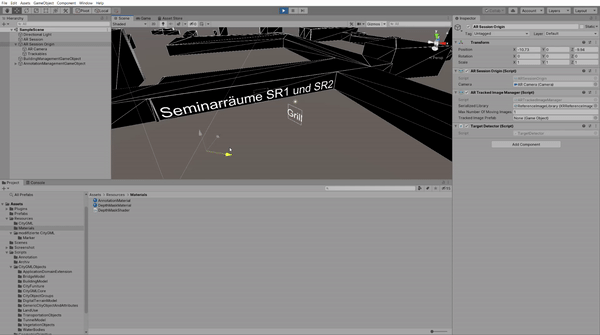

# GeoARS

For every place in our world, there are different levels of geodata from 2D to 3D. Modern augmented reality approaches allow combining this content visually with the real world on mobile devices. With the help of GeoARS, a Geo-Augmented-Reality-System-Implementation for the integration of 3D spatial data infrastructures in Augmented Reality (AR) environments, CityGML data with the level of detail 1 (LoD1) can be processed into Unity3D to build an AR app.

Two of the fundamental problems are the most accurate localization of the mobile device in space and the correct mapping of occlusions between the real world and digital content. Especially in urban areas, these occlusions are a significant problem, since the user's point of view is usually located between several buildings. 

The app uses targets to provide localization. Print all targets needed and add them to the target database **ReferenceImageLibrary** in the **Resources** folder. For correct functionality, specify the size of each printed target in the target database as well. Also, set the field of view of the virtual camera according to the hardware camera ones in the camera settings of Unity3D. The application uses ARFoundation, which utilizes *ARKit* (*iOS*) or *ARCore* (*Android*) depending on the target platform. Keep in mind that the app is only capable of running on devices that support one of these frameworks. 


## Requirements
* Unity3D 2020.1.0a17 (with Android and iOS Build Support)
* Visual Studio Code or Visual Studio 2019
* ARCore (Android) or ARKit (iOS) compatible end device for testing


## Getting Started

Copy the CityGML original data to the **Resources** folder. Make sure that this data is in the same coordinate system as the coordinates of the targets. The **Deserializer** class expects the following formatting (the length of the coordinates is irrelevant): 

```xml
<gml:pos srsDimension="3">33311699.707 5995492.332 61.22</gml:pos>
```

If necessary, adjust the coordinate formatting in the **ParseCoordinates()** method to the given coordinate formatting. Further adjustments can be applied in the **BuildingManager** class to customize the building representation. Consider interpreting *BuildingParts* as independent buildings if necessary, as the example treats **<Building>** and **<BuildingPart>** as self-contained buildings. The use of a depth mask prevents that virtual objects, which are hidden by buildings in the real world, are also hidden by their equivalent representation in the CityGML dataset and are not visible on the end device. Change the visibility of the virtual buildings as needed by changing the shader in the **Resources** folder.

```csharp
/// <summary>
/// Extract a 3D coordinate from a single string
/// </summary>
/// <param name="coordinates">3D coordinate as a string</param>
/// <returns></returns>
public static double3 ParseCoordinates(string coordinates)
{
    /// Splitting the coordinate string the format "x y z" (e.g. "33311699.707 599549.332 23.705") with the space as the separator
    string[] CoordValues = coordinates.Split(' ');
    
    /// Parsing the split string values with the coordinates into doubles:
    if (
        double.TryParse(CoordValues[0], NumberStyles.Any, CultureInfo.InvariantCulture, out double x) &&
        double.TryParse(CoordValues[1], NumberStyles.Any, CultureInfo.InvariantCulture, out double y) &&
        double.TryParse(CoordValues[2], NumberStyles.Any, CultureInfo.InvariantCulture, out double z)
        )
    {
        return new double3(x, y, z);
    }
    else
    {
        throw new ArgumentException("Coordinates could not be parsed: " + coordinates);
    }
}
```

In the case study, building annotations serve as virtual objects. An integration into the CityGML original data itself by using a CityGML *Application Domain Extension* (*ADE*) is possible as well as a generation at runtime in the **AnnotationManager** class. Use the Method **CreateAnnotationGameObject()**, passing the annotation text to be displayed and its text size. Annotations can be positioned and aligned by transforming the *GameObject* manually, or by using one of the predefined methods. **CreateOverviewAnnotation()** creates an annotation that scales with its distance of the user and thus keeps the displayed text size on the device constant. It also creates a permanent orientation to the viewer, as to be seen in the foreground (*Grill*) of the following demo picture. In contrast, the **CreateFocusAnnotation()** method creates an annotation with constant text size and orientation independent of the viewer as to be seen in the background (*Seminarräume SR1 und SR2*). With varying distance to the annotation, the display size on the device changes while it keeps constant in three-dimensional space.




## Built With

* [Unity3D DepthMask](http://wiki.unity3d.com/index.php?title=DepthMask)
* [sqlite-unity-plugin](https://github.com/rizasif/sqlite-unity-plugin)


## License

[CC BY-NC-SA](https://creativecommons.org/licenses/by-nc-sa/4.0/)
